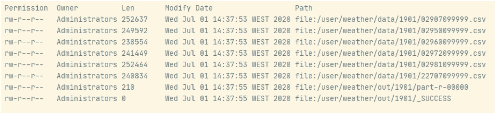

# Analyzing data with hadoop
Download, unTar and move to HDFS weather data and perform map 
reduce to find min and max temperature of a giving year by station

####Screens:

- Download and unTar files

- Programmatically running "hdfs dfs -ls"

- Map Reduce results

